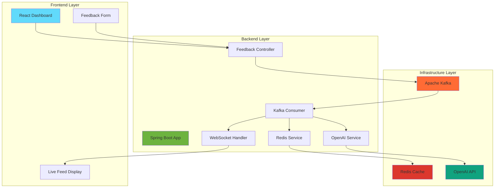
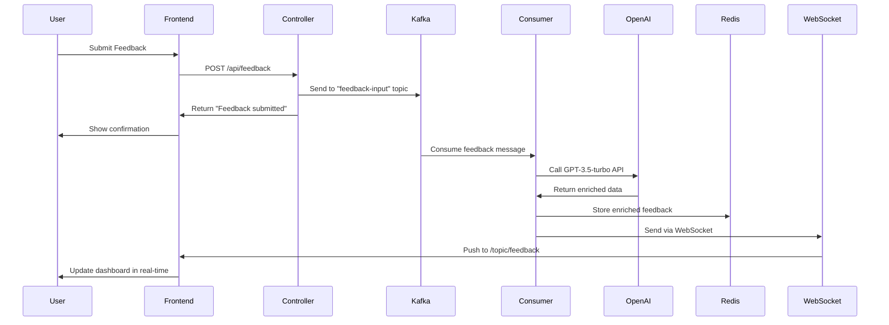
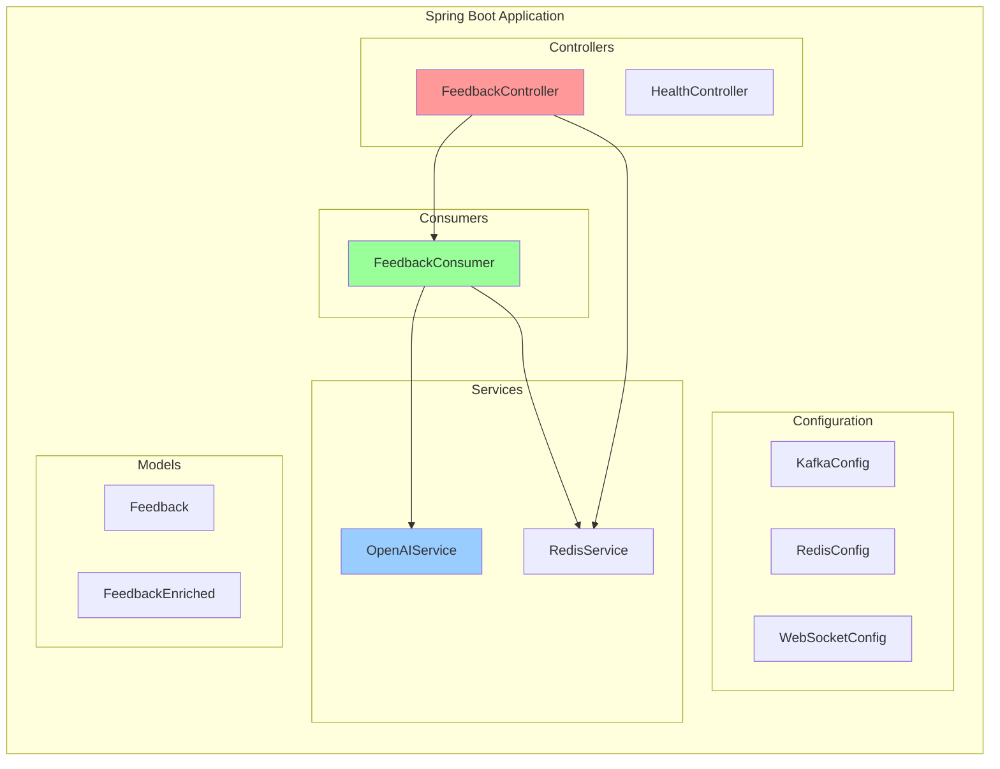
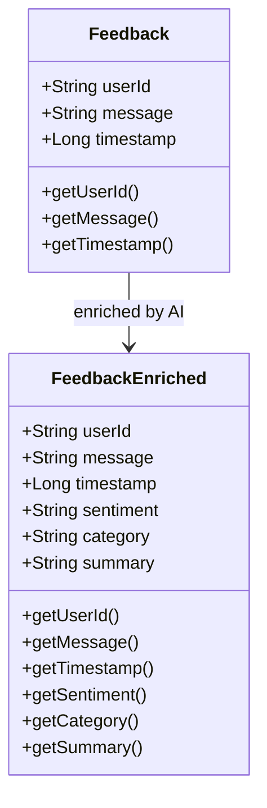
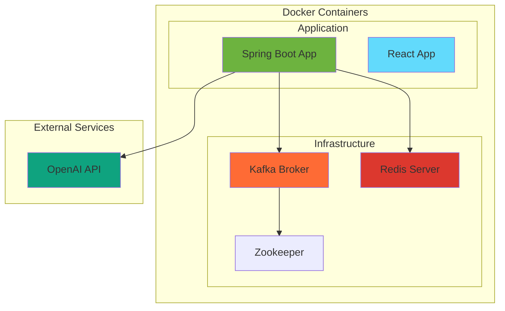
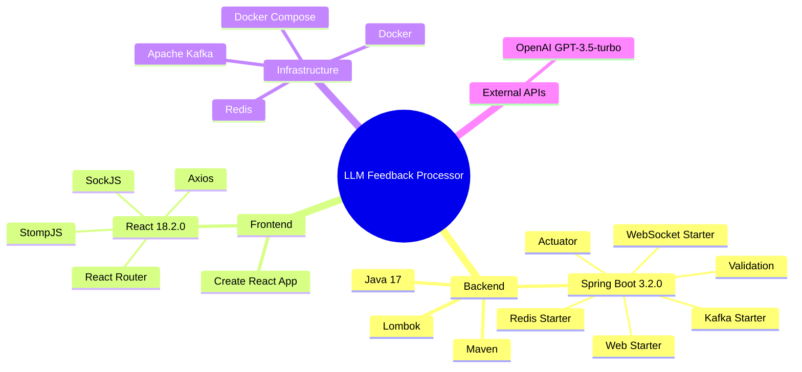
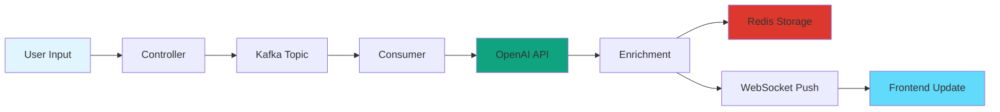
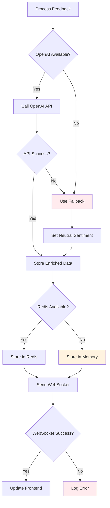

# LLM Feedback Processor - Architecture Diagrams

## 🏗️ System Architecture Overview

## 🔄 Complete Data Flow

## 🏛️ Component Architecture

## 📊 Data Models

## 🚀 Deployment Architecture

## 🔧 Technology Stack

## 📈 Processing Pipeline

## 🔄 Error Handling Flow

